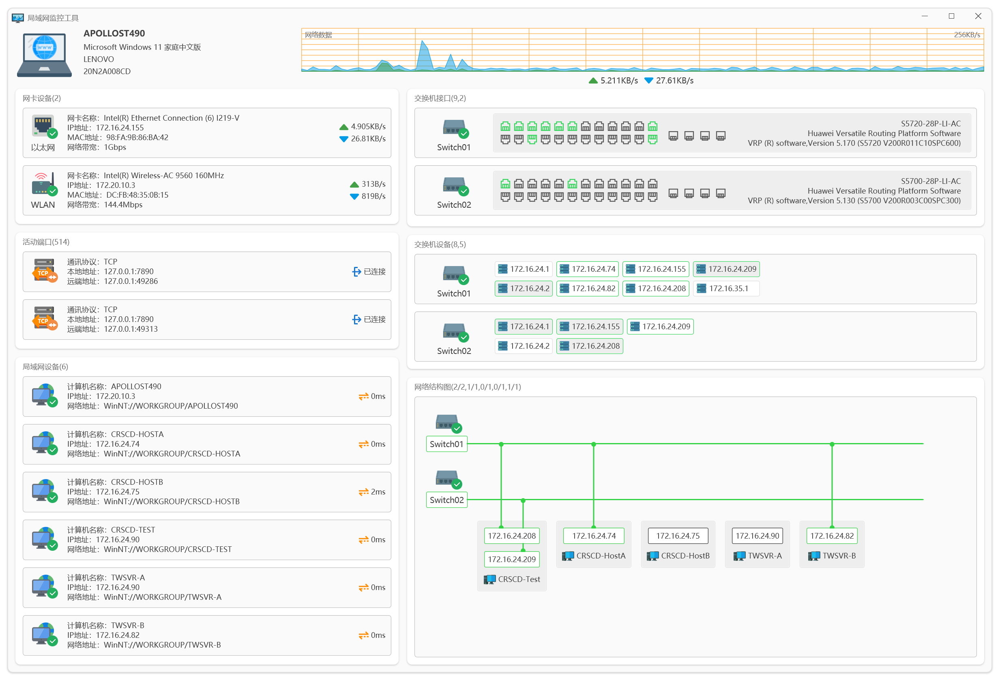

# LAN Network Monitor

A small widget for Windows that keeps observing your network speed and LAN computers.

## Features

- Observing your network download and upload speed
- Observing active network adapters listed in your computer
- Observing all available LAN computers and their network latency

## Donation

If you think this project is helpful to your development, you could just give me a cup of coffee. Thank you! ❤️

