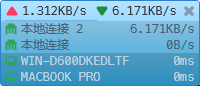

# 局域网监控工具

本程序为一款能够即时显示局域网内设备连接和数据通信状态的监控工具，可用于小型机房、工厂以及中小型网络环境的多设备监控工作，能够为网络状态监视、网络数据采集、通信故障排查等事务提供帮助和参考。



该程序具备以下几个方面的功能特点：

- 显示当前计算机的基本信息（计算机名、系统版本、设备厂商等）；
- 显示当前计算机所安装网络适配器的基本参数（适配器名称、IP地址、网络流量数据等）；
- 显示当前计算机的活动端口信息；
- 显示当前计算机所发现的局域网设备列表以及设备参数（该功能可能需要开启计算机的网络发现功能）；
- 使用SNMP访问交换机，显示交换机内部所提供的网络状态数据，包括：
    - 交换机的型号和固件版本信息；
    - 交换机各个网络端口的连接状态；
    - 交换机内部的ARP表；
    - 以线状连接图显示目标设备的网络连接状态。

## 交换机配置

交换机设备需事先完成以下设置项目：

- 设置交换机默认VLAN的IP地址（可根据需求划分多个VLAN）；
- 启用交换机的Telnet访问功能以及用户权限（可选）；
- 启用交换机的SNMP功能并设置用户访问权限；

## 计算机配置

计算机需完成以下配置：

- 清除可能会造成影响的其余系统设置；
- 正常启用防火墙和网络共享功能
- 启用网络发现功能；

## 程序配置

使用SNMP监视功能需要修改以下`app.config`文件中的设置项目：

```xml
<appSettings>
    <!-- 是否启用交换机监视功能 -->
    <add key="switch_enable" value="true"/>
    <!-- 交换机用户名称 -->
    <add key="switch_username" value="username"/>
    <!-- 交换机Auth密码 -->
    <add key="switch_auth" value="password"/>
    <!-- 交换机Priv密码 -->
    <add key="switch_priv" value="password"/>
</appSettings>
<!-- 交换机IP列表 -->
<switchList>
    <add key="Switch01" value="172.16.24.1"/>
    <add key="Switch02" value="172.16.25.1"/>
</switchList>
<!-- 局域网设备IP地址列表 -->
<deviceList>
    <add key="Host-A" value="172.16.24.101;172.16.25.101"/>
    <add key="Host-B" value="172.16.24.102;172.16.25.102"/>
    <add key="Host-C" value="172.16.24.103;172.16.25.103"/>
    <add key="Host-D" value="172.16.24.104;172.16.25.104"/>
</deviceList>
<!-- 交换机互联列表 -->
<connectionList>
    <add key="conn-A" value="Switch01;Switch02"/>
</connectionList>
```